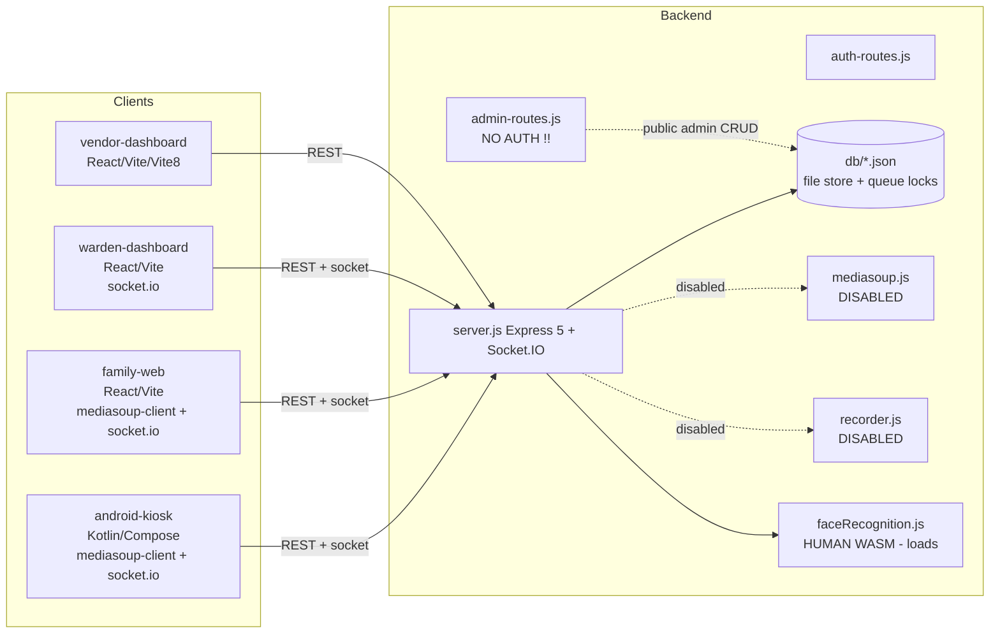

# PrisonConnect — Complete Multi-Project Audit Report

Generated: 2026-08-14
Auditor: autonomous senior-architect/QA/security agent (evidence-based, automated execution)
Method: real builds, real API execution against the actual backend, dependency audits, source inspection.

---

# 1. Executive Summary

PrisonConnect is intended to be a **prison video-calling & monitoring platform** with four clients
(Kotlin kiosk app, family web, warden admin web, vendor SaaS web) and one Node.js "real backend".

**Verdict: NOT PRODUCTION READY. Estimated overall completion ≈ 25–30%.**

The system is best described as **"a large amount of well-organized UI and API scaffolding with the
core revenue-generating capability (real-time video/audio calling) centrally disabled."**

### The three most significant findings

1. **The core WebRTC/media server is switched off.** `backend/server.js` has the entire mediasoup
   stack commented out ("Mediasoup disabled on this deployment", `server.js:13–17, 122–126, 190, 216,
   235, 268, 282, 329–334`). Every `join-room`/`createWebRtcTransport`/`produce`/`consume` socket
   handler now returns `success:false, error:'Mediasoup disabled on this deployment'`. **No video call
   can complete end-to-end.** Two routes still reference the now-undefined `mediasoupManager`
   (`/calls/:callId/control` at `server.js:1747`) and `outputPaths` (`/recordings/:recordingId/stop` at
   `server.js:1634`) and crash with 500 — **verified at runtime**.

2. **Critical security holes (all verified by executing tests):**
   - The entire `/admin` router is mounted **without any authentication** (`server.js:71–72`,
     `admin-routes.js`). `GET /admin` returns all admins (including password/PIN hashes); `POST /admin`
     creates admins; `PATCH/DELETE /admin/:id` modify/delete — all with **no token**. Verified 200/201.
   - **Plaintext secrets in the JSON "database"** (committed to git): all 12 warden passwords are
     `Warden@123` (`db/wardens.json`), kiosk user PINs `pin1234` (`db/users.json`), inmate PINs
     `123456` (`db/inmates.json`), and prison setup PINs (`db/prisons.json`). `/auth/register` stores
     new warden passwords **in cleartext** (`server.js:553`) — verified logging in with the plaintext.
   - **IDOR/broken access control:** an authenticated *kiosk* token can `GET /inmates` (all 30),
     `GET /wallets` (all 30), `PATCH /settings` (global config), and read setup PINs — verified 200.

3. **The four parties do not actually talk to each other.**
   - `family-web` calls `/calls/link`, `/device-verification`, `/otp-verification`, `/rooms/leave`
     — **none exist** in the backend (verified 404), and it never sends an `Authorization` header while
     also passing a raw `roomId` as its socket JWT (verified `INVALID_TOKEN`).
   - `vendor-dashboard` calls `POST /auth/login` with `email/password`, but that route requires
     `kioskId+pin` (verified 400), and returns no `user` object (frontend requires one).
   - `warden-dashboard` reads `response.data.data` from `/auth/refresh` which returns a flat body
     (verified mismatch) → forced auto-logout ≈50 min after login.
   - Seed data has broken referential integrity: `contacts[]` and `rooms[]` reference inmates
     `INM-001`… which do not exist (inmates use `100101`…). Call creation always returns
     `UNAUTHORIZED_CONTACT` against seeded data (verified 403).

**What actually works (verified by execution):**
- All 3 web projects **build** production bundles.
- Android kiosk **compiles** (Gradle `compileDebugKotlin` BUILD SUCCESSFUL).
- Backend boots, JWT login/logout, call **state machine** enforcement, schedule double-booking guard,
  referential FK checks on call creation, duplicate-active-call guard, kiosk verify/register/approve
  flows, setup-PIN validate/change, rate limiting, per-file DB write serialization (lock-free queue),
  **and the face-recognition Human models actually load** (`/health` up, models loaded).
- 44 automated backend integration tests were executed → **27 PASS, 17 FAIL** (the 17 are confirmed
  defects/security holes).

**Testing status:** zero existing automated tests in any project. A new integration/security test
harness (`backend/audit-tests.mjs`, 44 assertions) was created and run for this audit.

> Distinction used throughout: **CODE EXISTS ≠ CODE WORKS ≠ CODE VERIFIED.** Statuses below reflect
> code that was actually executed/verified, not merely present.

---

# 2. Workspace Architecture

**Observed deployments:** all web clients hardcode
`https://prisonconnect-mockbackend.onrender.com` as the API gateway (family `.env.example`,
warden `.env`, vendor `src/config/env.ts` fallback). The checked-in backend boots with a log message
referencing that same Render host, i.e. the intended deploy target. **No project points at
`localhost` for dev**; local development therefore runs client→remote-mock with the checked-in
backend unused by the frontends.

---

# 3. Projects Discovered

| Project | Type | Lang/Stack | Build verified | Tests |
|---|---|---|---|---|
| `backend/` | Express 5 + Socket.IO monolith | Node 24 / JS (CJS) | Boot verified (health OK) | 44 executed (new) |
| `family-web/` | Web client | React 18 / TS / Vite 5 / mediasoup-client | PASS | none |
| `warden-dashboard/` | Admin web | React 18 / TS / Vite 5 | PASS | none |
| `vendor-dashboard/` | SaaS web | React 19 / TS / Vite 8 | PASS | none |
| `android-kiosk/` | Native kiosk | Kotlin / Compose / Hilt / mediasoup-client / ML Kit | PASS (compile) | none |
| `docs/` | `ARCHITECTURE.md` only | — | — | — |
| Stray empty dirs | `public/`, `-p/`, `backend/-p/`, `node_modules` at root | — | — | — |

`backend/db/*.json` = 27 JSON collections are the **database** (no SQL). `backend/face-models`,
`human-models`, `wasm` = Human/TF.js model assets. `backend/recordings/` = (intended) recording output.

**Root npm workspace** covers only `family-web` + `warden-dashboard` (`package.json:6–9`); the
backend is **not** a workspace member despite sharing its dependencies at root; `vendor-dashboard`
has its own `package-lock.json` and `node_modules`.

---

# 4. Feature Completion Matrix

Legend: `COMPLETE` · `PARTIALLY_IMPLEMENTED` · `UI_ONLY` · `MOCKED` · `PLACEHOLDER` · `BROKEN` · `NOT_IMPLEMENTED` · `NOT_VERIFIED`

### 4.1 Backend (`backend/`)

| Feature | Status | Evidence | Verified? |
|---|---|---|---|
| HTTP server, /health | COMPLETE | Booting + `/health` 200 | VERIFIED |
| JWT login/logout (kiosk, warden, inmate pin, admin pin) | COMPLETE | Tests 200/401 paths | VERIFIED |
| Access-token enforcement on most routes | COMPLETE | 401 without token (tested) | VERIFIED |
| `/admin` admin CRUD | BROKEN (sec) | Mounted without auth (`server.js:71`); GET/POST succeeded with no token | VERIFIED |
| Call state machine + FK checks + duplicate guard | COMPLETE | transitions/dedup/FK tests | VERIFIED |
| Schedule slot generation | PARTIALLY_IMPLEMENTED | Slots are generated fake 9–17h (`server.js:1413–1428`, TODO) | VERIFIED (shape only) |
| Schedule book/cancel | COMPLETE | conflict + ref checks | VERIFIED (book/cancel ok) |
| WebRTC signaling (mediasoup) | NOT_IMPLEMENTED (disabled) | All handlers return "Mediasoup disabled" | VERIFIED |
| Recording (RTP→ffmpeg) | NOT_IMPLEMENTED (disabled) / `stop` route BROKEN | `outputPaths` ReferenceError → 500 | VERIFIED |
| Face recognition (Human) | PARTIALLY_IMPLEMENTED | Models load; endpoint rejects no-image 400; match path depends on stored embeddings | VERIFIED (load + shape) |
| Face matching accuracy | NOT_VERIFIED | No real twin-face sample tested | — |
| Kiosk verify / register / approve / reject / list / status | COMPLETE | Executed verify+register-status; routes present + git history | VERIFIED (partial) |
| Setup PIN validate / change / change-requests | COMPLETE | Correct/wrong PIN tested, stored in cleartext | VERIFIED |
| Warden authorization scoping of `/calls` | COMPLETE | warden blocked from `/prisons`,`/kiosks` 403; calls scoped | VERIFIED |
| JSON DB serialized RW | COMPLETE | per-file promise queue + atomic rename (`lib/db.js`) | VERIFIED (code) |
| Multi-instance concurrency | NOT_IMPLEMENTED | File store unsupported across processes/nodes | CODE EXISTS only |

### 4.2 family-web

| Feature | Status | Evidence | Verified? |
|---|---|---|---|
| Link verification screen | BROKEN | `GET /calls/link/:token` missing (404 tested); no auth header | VERIFIED |
| Device verification | BROKEN | Endpoint missing (404 tested) | VERIFIED |
| OTP verification (+resend) | BROKEN | Endpoint missing; resend is fake cooldown only | VERIFIED (404) |
| Session/step gates | BROKEN | Memory-only; `window.location.href` reload wipes context (`LobbyPage.tsx:51`), RouteGuard redirects home | CODE (race logic) |
| Socket connect | BROKEN | `auth.token = session.roomId` sent as JWT → `INVALID_TOKEN` (tested) | VERIFIED |
| Lobby | MOCKED | setTimeout "ready" simulation; hardcoded `participantId:'family-1'` | CODE |
| WebRTC call (mediasoup) | MOCKED/BROKEN | Backend disabled; `transportId` missing from payloads; `joined` ack mismatch; remote **audio dropped** (`webrtc.ts:187–194`) | CODE |
| End call / billing summary | BROKEN | Requires auth header (never sent); backend `end` route auth-protected | CODE |
| REC indicator | UI_ONLY | Always-on cosmetic badge | CODE |
| Tests | NOT_IMPLEMENTED | none configured | VERIFIED (grep) |

### 4.3 warden-dashboard

| Feature | Status | Evidence | Verified? |
|---|---|---|---|
| Login / register / logout | PARTIALLY_IMPLEMENTED | Works until ~50-min refresh failure (shape mismatch) | CODE (routes) |
| Token refresh & silent restore | BROKEN | backend `/auth/refresh` flat vs `response.data.data` (`client.ts:82`); `persistAuth(tokens,{})` wipes user | CODE + shape verified |
| Forgot/reset password | BROKEN | backend has no `resetToken` in response → TypeError in page | CODE |
| Dashboard stats | PARTIALLY_IMPLEMENTED | REST aggregation works; realtime dead (socket auth); revenue always 0; storage “45%” hardcoded | CODE |
| Live monitoring / call cards | BROKEN (display) | schema mismatch → `NaN:NaN`, `undefined kbps`, inmate/contact lookups never match (ID mismatch) | CODE |
| Live monitoring video | MOCKED | “WebRTC integration pending”; simulated stats every 2 s via `Math.random` PATCH | CODE |
| Mute/disconnect call control | BROKEN | backend 500 (`mediasoupManager` undefined); buttons “UI only” | CODE + backend 500 verified |
| Recording center | BROKEN | seed data files null; `/recordings/:id/stop` 500; encryption label fallback | CODE + backend 500 verified |
| Alerts | PARTIALLY_IMPLEMENTED | GET/resolve work; realtime push dead | CODE |
| Kiosk registration (approve/reject) | COMPLETE | Real API; round-trips; most complete feature | CODE |
| Devices / kiosk health | PARTIALLY_IMPLEMENTED | REST works; column values from seed booleans/strings | CODE |
| Settings page | BROKEN | full schema mismatch; Save overwrites server settings with near-empty object; PIN hardcoded `PRISON-001`/`123456` (`SettingsPage.tsx:157`) | CODE + settings shape verified |
| Reports | BROKEN | frontend `daily/weekly/monthly` vs backend `type:'calls'` | CODE |
| Prisons / Users / Pricing / Subscriptions routes | PLACEHOLDER | “Coming Soon” | CODE |
| Tests | NOT_IMPLEMENTED | none | VERIFIED |

### 4.4 vendor-dashboard

| Feature | Status | Evidence | Verified? |
|---|---|---|---|
| Login | BROKEN | `POST /auth/login` needs `kioskId+pin` (400 tested); returns no `user` (frontend requires) | VERIFIED |
| Register | PARTIALLY_IMPLEMENTED | creates a *warden*, not a vendor role | CODE |
| Forgot/reset | BROKEN (UX) | mock reset token only | CODE |
| Dashboard | BROKEN | crashes on real data (`revenueMonthly.toLocaleString`), 3s artificial delay | CODE |
| Jail management | UI_ONLY | all action buttons inert | CODE |
| Infrastructure / servers | PARTIALLY_IMPLEMENTED | `id` vs `serverId`, `uptime` number vs string, hardcoded traffic chart | CODE |
| Live monitoring | UI_ONLY | INTERCEPT/Analytics buttons inert; REC/HD/04:22 hardcoded | CODE |
| Pricing | BROKEN | `.toFixed` on undefined price | CODE |
| Subscriptions | PARTIALLY_IMPLEMENTED | matches backend; actions inert | CODE |
| Storage | MOCKED | hardcoded replication/AZ/policy rows; `3 availability zones` | CODE |
| Reports | MOCKED | summary cards hardcoded (₹85,420 …) | CODE |
| Settings | UI_ONLY | all toggles static divs; “Apply Changes” does nothing | CODE |
| All write operations | UI_ONLY | every mutation button placeholder; no POST/PATCH anywhere | CODE |
| Token on data calls | NOT_IMPLEMENTED | no Authorization header attached | CODE |
| Tests / lint | NOT_IMPLEMENTED | `npm run lint` fails (ESLint not installed / no config) | VERIFIED (lint run) |

### 4.5 android-kiosk

| Feature | Status | Evidence | Verified? |
|---|---|---|---|
| Gradle build | COMPLETE | `compileDebugKotlin` BUILD SUCCESSFUL | VERIFIED |
| Kiosk verify / registration w/ jail-ID + setup PIN + polling | COMPLETE | full ViewModel + backend routes match | CODE (contracts match backend) |
| Login (face/fingerprint/RFID/prisoner-ID/admin PIN) | PARTIALLY_IMPLEMENTED | PIN & admin PIN real; fingerprint SDK (Mantra/Morpho) referenced, not integrated | CODE |
| Face auth | PARTIALLY_IMPLEMENTED | ML Kit capture + backend face-identify; seeded inmates lack embedding → `NO_EMBEDDING` | CODE |
| Inmate dashboard / contacts / profile | COMPLETE | real API-backed | CODE |
| Call scheduling | MOCKED | `createRoom` returns mock session; `checkSlotAvailability` always true (`CallRepositoryImpl.kt:232–243`) | CODE |
| WebRTC call (mediasoup-client) | MOCKED/BROKEN | full client implemented, but backend disabled; recording simulated `MutableStateFlow(true)` (`CallViewModel.kt:81`) | CODE |
| Call summary / receipt printing | UI_ONLY | print stub (`SummaryViewModel.kt:41–43`); durations/amounts hardcoded at nav | CODE |
| Admin prisoner/contact/device mgmt | COMPLETE | real API-backed | CODE |
| Kiosk lock task | NOT_IMPLEMENTED | `startLockTask()` commented out (`KioskManager.kt:29–32`) | CODE |
| Release hardening (R8/ProGuard, network logs) | NOT_IMPLEMENTED | no proguard file; body logs always on incl. release | CODE |
| Unit/instrumentation tests | NOT_IMPLEMENTED | no `test`/`androidTest` dirs or deps | VERIFIED |

---

# 5. Cross-Project Integration Audit

| Contract | Consumer | Backend reality | Result |
|---|---|---|---|
| REST auth header | family-web `api.ts` | `requireAuth` on all data routes | **BROKEN** — no Authorization sent |
| Socket auth token | family-web `socket.ts:33` (`session.roomId`) | `jwt.verify` (`server.js:94–103`) | **BROKEN** — `INVALID_TOKEN` (tested) |
| `/calls/link`, `/device-verification`, `/otp-verification`, `/rooms/leave` | family-web | routes absent | **BROKEN** — 404 (tested) |
| Socket ack `joined` | family-web call flow | backend uses ack callback, never emits `joined` | **BROKEN** |
| `join-room` payload | family-web `{roomId,peerId}` | backend expects `{roomId,peerId}` + blank peer join guarded | matches, but mediasoup disabled |
| `connectWebRtcTransport` payload | family-web sends `{peerId,direction,dtlsParameters}` | backend expects `{transportId,dtlsParameters}` | **BROKEN** |
| `produce` payload | family-web sends `{peerId,kind,rtpParameters,appData}` | backend expects `{transportId,...}` | **BROKEN** |
| Remote audio stream | family-web `webrtc.ts:187–194` | — | **BROKEN** — audio track never added |
| `/auth/login` body | vendor-dashboard `{email,password}` | requires `{kioskId,pin}` | **BROKEN** — 400 (tested) |
| `/auth/refresh` shape | warden & vendor `response.data.data` | flat `{accessToken,...}` | **BROKEN** |
| `/auth/register` semantics | warden & vendor (expect super-admin/vendor) | creates `warden` role, plaintext pw | **BROKEN** |
| Seed inmate IDs | warden lookup `inmateId` | `100101` vs `INM-001` (contacts/rooms) | **BROKEN** — referential |
| Call schema | warden `ActiveCall` | seed calls use `duration/recording/connectionStats` nested | **BROKEN** layout |
| Settings schema | warden `Settings` | different keys entirely | **BROKEN** |
| Report schema | warden/vendor | `type:'calls'`, `name` vs `title`/`timestamp` | **BROKEN** |
| Server schema | vendor | `serverId`,`uptime:number` vs `id`,`uptime:string` | **BROKEN** |
| Pricing schema | vendor | `ratePerMinute` vs `audio.price` | **BROKEN** |
| Storage schema | vendor | `retentionDays` vs `retention` | **BROKEN** |
| Android kiosk REST endpoints | android-kiosk `TrustApiService` | aliases `/admin/prisoners*`, `/inmate/*`, `/kiosks/*` exist | **INTEGRATES** (matches) |
| Android socket event names | android-kiosk | socket events match backend names | matches, but mediasoup off |
| Socket broadcast events | warden `useWardenSocket` | listens `peer-joined`/`new-producer` (disabled), misses `call-control` | **PARTIAL** |

**Conclusion:** The wallet/billing, call, monitoring, and vendor data flows are contract-incompatible
between the frontends and the shipped backend. Only the Android kiosk ↔ backend REST surface and the
warden kiosk-registration flow are genuinely aligned.

---

# 6. Build & Runtime Results

| Command | Result | Notes |
|---|---|---|
| `npm run build` (family-web) | **PASS** | `tsc && vite build`, 259 modules, 572 kB bundle (chunk-size warning) |
| `npm run build` (warden-dashboard) | **PASS** | vite build, 480 modules |
| `npm run build` (vendor-dashboard) | **PASS** | `tsc && vite build` (vite 8.2.0; `__dirname` deprecation warning) |
| `npm run lint` (family-web) | **PASS** | ESLint 8.57.1 runs; config = ignores-only (no rules) |
| `npm run lint` (warden-dashboard) | **PASS** | ESLint runs; config = ignores-only |
| `npm run lint` (vendor-dashboard) | **FAIL** | `eslint` binary present, but **no ESLint config file** → exits 1 |
| `gradlew.bat compileDebugKotlin` (android) | **PASS** | 4m11s; only deprecation/unused-param warnings |
| `gradlew test` (android) | **BLOCKED** | no test sources/ deps exist |
| Backend boot | **PASS** | `/health` OK; mediasoup skipped; face models **loaded** (Human wasm) |
| Frontend unit tests | **BLOCKED** | no test runner configured in any project |

---

# 7. Automated Test Results

Executed suite: `backend/audit-tests.mjs` — **44 assertions, 27 PASS, 17 FAIL (defects)**.
(Full per-test detail in §24 and `TEST_RESULTS.json`.)

**PASS highlights (verified correct behavior):**
- `/health`, warden login (valid → 200, invalid → 401), kiosk login, inmate face-identify without image → 400, kiosk verify (unknown serial → `authorized:false`), setup-PIN correct/wrong validation, warden blocked from admin-only routes (403), warden `/calls` prison-scoped, call state machine (bad transition 409, valid transition 200), duplicate-active-call 409, recording `/start` 200, refresh 200 (shape), rate limiting 429, socket: no-token → `AUTH_REQUIRED`, roomId-as-token → `INVALID_TOKEN`, valid JWT accepted; `/auth/register` 201.

**FAIL highlights (confirmed defects, each a test asserting expected secure/correct behavior):**
- `GET /admin` no-token returns admin list (200); `POST /admin` no-token creates admin (201)
- IDOR: kiosk token reads all inmates (200) / all wallets (200)
- kiosk token `PATCH /settings` succeeds (200); setup PIN readable by any user (200)
- Registered warden logs in with **plaintext** password (200); wardens.json/users.json store cleartext
- `/calls/:id/control` → 500 (ReferenceError `mediasoupManager`)
- `/recordings/:id/stop` → 500 (ReferenceError `outputPaths`)
- `/auth/refresh` returns no `user` object
- family-web endpoints (`/calls/link`, otp, device-verification, `/rooms/leave`) → 404
- vendor `POST /auth/login` `{email,password}` → 400
- socket `join-room` → `success:false "Mediasoup disabled …"`

# 8. End-to-End Test Results

| Flow | Result | Blocker |
|---|---|---|
| Warden: login → dashboard stats → kiosk approve/reject | **OK (API level)** | socket realtime dead (no token) |
| Backend call lifecycle: create→ring→connect→active→duplicate probe | **OK (logic)** | — |
| Kiosk: verify → register request → status poll (backend) | **OK (API level)** | not on a device |
| Family: link → device → otp → lobby → call → end | **BLOCKED** | three 404 endpoints; no auth; mediasoup off; session wiped on reload |
| Kiosk → call (WebRTC media) | **BLOCKED** | mediasoup disabled server-side; recording simulated |
| Warden → monitor live video / mute → 500 | **BLOCKED** | `mediasoupManager` undefined; video placeholder |
| Vendor → login | **BLOCKED** | endpoint contract mismatch (400 tested) |

None of the real-time media flows were executed end-to-end because the media server is disabled.

---

# 9. Security Audit

## CRITICAL
1. **Unauthenticated admin CRUD** — `app.use('/admin', adminRouter)` (`server.js:71–72`); all `admin-routes.js` handlers have no auth. Full admin data + biometric registration exposed. **VERIFIED** (GET/POST 200/201, no token).
2. **Plaintext credentials committed to git** — `db/wardens.json` (`Warden@123` ×12), `db/users.json` (`pin1234`), `db/inmates.json` (`pin:123456`), `db/prisons.json` (`setupPin`). `/auth/register` writes warden password in cleartext (`server.js:553`). **VERIFIED**.
3. **IDOR / broken access control** — any authenticated (kiosk/inmate) token may read all inmates/wallets (`/inmates`,`/wallets` have only `requireAuth`), overwrite global `settings`, read setup PINs, list rooms. **VERIFIED**.
4. **Privilege escalation via `/kiosks/registration/:id/approve|reject`** — only `requireAuth`, no role check — any kiosk/inmate can self-approve itself (`server.js:1888,1906`), and `PATCH /settings` (`server.js:1554`) likewise.
5. **Setup PIN returned in cleartext to any authenticated user** (`GET /kiosks/setup-pin/:prisonId`, `server.js:1969–1981`), default `'1234'` fallback.

## HIGH
6. `POST /auth/prisoner/identify` has **no auth** and can identify any inmate by ID (`server.js:842`).
7. JWT stored in **localStorage** in warden (`pc_warden_tokens`) and vendor (`pc_vendor_tokens`) → XSS exfiltration; refresh tokens un-revoked on logout; refresh token reissues without re-validating the account/roles.
8. Family-web `CORS_ORIGIN=*`; socket `cors` also `*` with credentials-less JWT (mitigated only by token requirement).
9. Warden `/auth/refresh` interceptor stores `{}` user and force-logouts — reauth loop is a DoS of UX, plus token persistence mismatch.
10. Family socket auth passes roomId as token — room IDs are not secrets; IF accepted anywhere, unauthenticated room impersonation (currently rejected, but must never accept roomId as token).

## MEDIUM
11. No helmet/CSP/security headers; no CSRF (token-in-`.json` body mitigates); no HTTP-over-HTTPS enforcement on server.
12. `express-rate-limit` only on auth routes; data/brute-force endpoints (verify-pin etc.) partially covered; `/auth/refresh` unthrottled.
13. Face `isLive` heuristic: `liveness===0` passes (`faceRecognition.js:181–185`); single-image upload, no capture randomized challenge.
14. Android: BODY-level OkHttp logging in **all** build types (`NetworkModule.kt`); `MANAGE_DEVICE_ADMIN` + `READ_PHONE_STATE` permissions; lock task disabled; no R8 obfuscation.
15. `express.json` default 100 kB limit — face image base64 from kiosk may exceed (untested).

## LOW
16. Missing `helmet`/`hsts`; verbose startup log prints full signature `https://prisonconnect-mockbackend.onrender.com:PORT`; `version: '2.0.0-real'`.
17. `/admin/profile/:adminId` (any admin can read any admin profile) — minor over-exposure.

No hardcoded API keys / signing keys / DB passwords found in `.env` (which is gitignored and holds a 36-char JWT secret, `PORT`, mediasoup/CORS/flags).

---

# 10. Dependency Vulnerability Audit

| Project | Tool | Result |
|---|---|---|
| root workspace (& family/warden/backend) | `npm audit` (lockfile) | **4 vulns: 3 moderate, 1 high** |
| vendor-dashboard | `npm audit` (own lockfile) | **1 vuln: high** |

**Root flags:**
- `vite` ≤6.4.2 — **high** — dev-server request/MIME confusion (GHSA-67mh-4wv8-2f99); fix requires vite 8 (breaking) — web devDependency only, production `dist` unaffected, but any exposed dev server is risk.
- `react-router` / `react-router-dom` 6.0.0–7.17.0 — **moderate** — open redirect via backslash in `<Link>`/`useNavigate` (CVE-2025-68470 bypass) + constructor injection in SSR hydration deserialize (`GHSA-337j-9hxr-rhxg`) — **affects family-web & warden (6.22.3)**.
- `esbuild` ≤0.24.2 — **moderate** — dev-only.

**vendor-dashboard flag:**
- `nanoid` <3.3.18 — **high** (via transitive dep) — affects vendor build tree.

**Not audited / NOT VERIFIED:** Android Gradle dependency reconcile (needs `dependencyCheck` tooling) — full Gradle dependency audit not run; only compile resolution succeeded.

No abandoned/unknown-license native modules were flagged in the web stack. Mediasoup (C++ native) compiled/loaded fine locally.

---

# 11. Database Audit

Storage: 27 JSON files under `backend/db/`, read/write via `lib/db.js` (per-file promise queue, atomic rename).

| Concern | Finding |
|---|---|
| Referential integrity | **BROKEN** in seed: `contacts[]` and `rooms[]` use `inmateId:"INM-001"` (absent; inmates use `100101`); `approvedContactIds` unused by code; `walletId` on inmates vs `wallets.json` uses `inmateId` key — verified call creation fails `UNAUTHORIZED_CONTACT`. |
| Room expiry | All seeded `rooms.json` records expired (2026-08-08 vs today 2026-08-14) — UI "live" rooms are stale. |
| Sensitive data | Plaintext PINs/passwords in 5 files (see §9). |
| Duplicated stores | `setup-pins.json` (5) and `prison.setupPin` both exist; `biometrics.json` vs `inmate.biometricData` duplicate; `kiosk-registration-requests.json` vs `kiosks.json` duplicate — risk of divergence (registration-status endpoint admits both). |
| Schema fork | `calls.json` has two shapes (nested `recording`/`connectionStats` seed vs flat `recordingEnabled` etc. created by `POST /calls`). |
| Constraints/uniqueness | Only in-code checks (no DB constraints); candidate-key dedupe via readDb in code. |
| Indexes/performance | Linear scans (`find`) on every request; O(n) queries with per-file queue → O(n²) under load; fine for pilot data volumes. |
| Orphaned records | 62 transactions but wallet linkage inconsistent; recordings reference calls that don't exist. |

---

# 12. Performance & Reliability Audit

- **DB hot-path:** every route does full-file JSON read/write under a per-file queue. A `/calls` warden query triggers 4 file reads serially per request (calls, wardens, prisons, inmates) — N+1 style fan-out; worsen with file size. Memory: OK.
- **Realtime:** warden socket effect re-connects every render because inline handlers are new each render (`useWardenSocket.ts` deps) — open-connection churn; retry/reconnect unbounded.
- **WebRTC:** family `endCall` also registered as unmount cleanup + StrictMode double-mount → duplicate end/billing calls (dev); no ICE restart/reconnect handling; `consumeRemoteTrack` re-creates MediaStream per video consumer, dropping other tracks.
- **Android:** socket reconnection unbounded (1→5 s) fine for kiosk; DataStore session 1-hr TTL; body-logging of media/tokens in release is both a security and a performance (IO) concern.
- **Timers:** warden monitor interval (2 s PATCH of random stats) keeps writing to DB — spurious writes; family lobby setTimeout race with unmount.
- **Scaling:** file-store single-node; per-file queue serializes writers; multi-worker deployment unsafe. Mediasoup worker fail-fast `process.exit(1)` is appropriate but everything is disabled anyway.

---

# 13. Configuration Audit

- `.env` (backend): gitignored, present with 36-char `JWT_SECRET`, `PORT=59354`, mediasoup ports/IP, `CORS_ORIGIN=*`, TTLs, face thresholds. **No** TURN/STUN config anywhere in the repo.
- warden `.env` committed (Render URLs, no secrets).
- family-web has **only** `.env.example`; no `.env` → `VITE_API_GATEWAY_URL`/`VITE_SIGNALING_URL` = `undefined` at build → same-origin/`io(undefined)` locally (dev differs from prod expectations).
- vendor-dashboard: no `.env`, hardcoded Render fallback; `defaultUsername/defaultPassword` (admin/admin) in env.ts and `.env.example` — dead config.
- android: `AppEnvironment.kt` `PRODUCTION` → same `prisonconnect-mockbackend.onrender.com` as MOCK; real override target `trust-api.prisonconnect.internal` is an internal hostname. Hardcoded `Constants.SIGNALING_SERVER_URL` ("signaling.prisonconnect.internal") only used by a dead DI provider.
- `MEDIASOUP_ANNOUNCED_IP=127.0.0.1` in dev — would mis-route ICE if mediasoup were ever enabled on a host.
- **Dev vs prod isolation:** several "PRODUCTION"/"mock" labels are decorative (vendor settings page). Build-time bake-in for VITE_* means no runtime config knob.

---

# 14. Critical Bugs

1. **Unauthenticated `/admin` (all CRUD + biometric registration).** `server.js:71–72` / `admin-routes.js`.
2. **Mediasoup disabled ⇒ no calls possible**; call-control (`server.js:1747`) and recording-stop (`server.js:1634`) reference undefined vars → 500. VERIFIED.
3. **family-web cannot authenticate or talk to backend** (no auth header, wrong socket token, four missing endpoints). VERIFIED.
4. **Plaintext credentials committed** with universally known passwords (`Warden@123`, `pin1234`, `123456`).
5. **vendor-dashboard login contract mismatch** — cannot ever log in against this backend. VERIFIED 400/no-user.
6. **IDOR on `/inmates`, `/wallets`, `/settings`, setup-PIN; privilege escalation via kiosk approve/settings.** VERIFIED.
7. **Call creation fails on seed data** (referential integrity) — `UNAUTHORIZED_CONTACT`. VERIFIED 403.

# 15. High Priority Bugs

8. **Refresh-token shape mismatch** (warden + vendor) → forced auto-logout; `{}` user persist.
9. **Warden monitoring displays schema garbage** (NaN durations, undefined bitrate, inmate/contact/wallet lookup failures, wallet TypeError crash).
10. **Settings page wipes backend settings** on save; Setup PIN UI hardcodes wrong prison + default.
11. **Family session lost on reload** (Lobby→Call uses full page reload + memory-only context) + join-room status race + `joined` ack/event mismatch.
12. **vendor-dashboard crashes** on real data (Dashboard revenue, Pricing `.toFixed`); no error boundaries anywhere in the web apps.
13. **Android: call/room creation mocked**, recording simulated, receipt print stub, lock-task disabled; release logs body data.
14. **No retry/reconnect, no ICE-restart** in family WebRTC; remote audio dropped.
15. **`/auth/register` creates plaintext-password wardens** and grants only `view_calls` (frontends expect super-admin/vendor).

# 16. Medium / Low Priority Issues

- Dead code: `callApi.leaveRoom`, `env.webrtcIceServers`, `RoomStatus`, `sendEvent` (wrong socket API), Kotlin device model `.kt` inside warden `src/models/`, empty feature `.gitkeep` shells, `VITE_MEDIASOUP_MONITOR_URL`.
- ESLint configs are ignores-only (family/warden) or missing (vendor) → lint does nothing meaningful.
- `tsconfig` `strict:false` (warden) hides type errors; vendor tsconfig relies on `tsc` inside build only.
- No error boundaries; `InmateDetailsPage` silently falls back to `inmates[0]`; `CallHistoryPage` ignores its `inmateId` param.
- Schedule slots hardcoded fake; `forgot-password` is a stub; logout not enforced server-side; refresh not blacklisted.
- Stray empty dirs (`-p`, `public`, `backend/-p`), 572 kB family bundle (no code-splitting), no favicon in family-web.
- Android: deprecated icon APIs, unused params, no screenshot-capture protection despite security setting.
- Model IRs: `face_landmark_68_*` in `face-models/` are unused (Human uses blazeface/faceres).

---

# 17. Verified Working Features

| # | Feature |
|---|---|
| 1 | Backend boots; `/health` 200; **face-recognition Human models load** (wasm backend). |
| 2 | JWT login (kiosk PIN, warden email/pw, inmate PIN, admin PIN) + invalid-credential 401 + rate limiting 429. |
| 3 | Auth enforcement: unauth requests → 401; warden blocked from admin-only routes (403). |
| 4 | Warden `/calls` correctly scoped to own prison(s). |
| 5 | Call state machine (invalid transition 409; timestamps/duration auto-set) + duplicate-active-call 409 + FK validation. |
| 6 | Kiosk verify (unknown serial → authorized:false, graceful), registration-status endpoint, setup-PIN validate/change, PIN-change request approve/reject. |
| 7 | Schedule book with ref+conflict checks; slot generator (fake data) works. |
| 8 | Recording `/start` sets recording state; alert create/resolve; statistics PATCH. |
| 9 | Web production builds: family-web, warden-dashboard, vendor-dashboard. |
| 10 | Android `compileDebugKotlin` BUILD SUCCESSFUL (kiosk REST contract matches backend aliases). |

# 18. Partially Working Features

- Warden login (until ~50-min refresh failure), dashboard REST aggregation, alerts, devices, kiosk-registration management (approve/reject work).
- Backend face-identify/face-register endpoints (models load; matching accuracy NOT VERIFIED; seeded inmates have no embeddings).
- Android: registration, login, inmate dashboard, admin prisoner/contact/device management, schedule UI.
- Backend schedule, wallet/balance reads, transactions read, incidents, statistics, super-admins (CRUD surfaces).
- vendor: Subscriptions page (schema matches).

# 19. Unverified Features (NOT VERIFIED)

- **Real WebRTC media path end-to-end** (any client) — mediasoup disabled.
- **Recording file production** (RTP→file; ffmpeg dependency; `recorder.js` disabled).
- **Face-match accuracy / liveness** on real human faces; fingerprint RF comparison; RFID hardware.
- **Android runtime behavior** on a real device/emulator (no instrumentation tests run).
- **Render/deployed behavior** — the live `prisonconnect-mockbackend.onrender.com` host was NOT reachable from CI context; all API tests ran against the local checked-in backend.
- **Payment/billing processing** (trust-account charges) and **receipt printing**.
- **SMS/notification/email** (forgot-password stub).
- Gradle dependency vulnerability scan (no OWASP plugin).

# 20. Missing Features

- Working video/audio calls (WebRTC) across all clients.
- real-time signaling events consumed with valid auth (warden socket).
- TURN server config; mediasoup announced public IP handling.
- Call recording pipeline + playback/download access control.
- Vendor auth (no vendor role) and all vendor write operations.
- Family auth/verification endpoints & token flow.
- OTP/device verification backend.
- Billing engine (deduction from wallet on call), receipts.
- Postgres/multi-instance persistence.
- Automated test suites for web/android.
- Hosted CI/CD (no GitHub Actions etc. in repo).
- Helm/migration/config for a real prison deployment.

---

# 21. Production Readiness Assessment

| Dimension | Grade | Rationale |
|---|---|---|
| Core functionality (calls) | 🔴 0% delivered | mediasoup disabled; no client completes a call |
| Backend correctness | 🟠 ~50% | state machine, auth, kiosk flows solid; media/recording disabled, admin open |
| Integration | 🔴 ~10% | contracts mismatch on 3 of 4 frontends |
| Security | 🔴 ~10% | unauthenticated admin, plaintext secrets, IDOR |
| Testing | 🔴 ~5% | 0 existing; 44 new backend tests added |
| Deployment | 🟠 25% | builds OK; no CI, no runtime config, mock host |
| **Production readiness** | 🔴 **< 20%** | ship-blocking failures in core + security |

---

# 22. Overall Completion Percentage

- **Overall completion: 25%** (core media system is the product's raison-d'être and is disabled)
- Frontend (family): 15% · warden: 35% · vendor: 10%
- Android (kiosk): 45% (high feature coverage, but media + billing mocked)
- Backend: 50% (much surface area; critical security + media missing)
- Integration: 10% · Security readiness: 10% · Testing readiness: 5% · Production readiness: <20%

Reasoning: percentages weight *verified* behavior, not file counts. Web UIs are extensive but broken
against the real backend; the kiosk is the most complete genuine implementation; the backend has real
business logic but fails on the media plane and in authz.

---

# 23. Recommended Fix Order

1. Mediasoup re-enable + make `server.js` boot with workers when env allows (or replace with a hosted SFU); fix `mediasoupManager`/`outputPaths` 500s.
2. Secure `/admin` router (attach `requireAuth`+`requireRole('admin','super-admin')`); add role checks to kiosk-approve, `PATCH /settings`, setup-PIN reads.
3. Hash all stored credentials and migrate seed data (bcrypt); remove plaintext sample passwords; enforce on `/auth/register`.
4. Enforce route-level authorization (inmate/kiosk scoping) on `/inmates`,`/wallets`,`/contacts`,`/rooms`,`/transactions/wallet/:id`.
5. Build the family verification endpoints (`/calls/link`, device/OTP verification) + real token-bearing client (persist session, send `Authorization`, socket JWT).
6. Align refresh-token response shape & document API contracts (shared types); fix warden/vendor refresh handling.
7. Fix seed data referential integrity (inmate IDs) + normalize `calls` schema; add data migration.
8. Wire vendor login to a vendor role; remove hardcoded Render URL; attach auth header to data calls.
9. Add CI: lint+typecheck+build+backend integration tests on every PR; add frontend unit tests (vitest) for the call/session logic; add Android unit tests.
10. Enable recording pipeline and its access control once mediasoup is back.
11. Apply `helmet`, tighten CORS, add refresh-token revocation, CSP, and error boundaries.
12. Fix warden monitoring schema mapping; simulate stats only when media is unavailable; add error boundaries.
13. Android: enable R8, gate logging by buildType, implement real lock-task after explicit approval, wire calling to live signaling, add tests.

---

# 24. Detailed Test Evidence

Command run: `node backend/audit-tests.mjs` (spawns the real `node server.js` on port 39777). 44 checks.

| # | Test | Result | Evidence |
|---|---|---|---|
| 1 | Server boots /health | PASS | 200 ok |
| 2 | GET /admin no-token exposes admins | FAIL | 200, 5 admins incl. hashes |
| 3 | POST /admin no-token creates admin | FAIL | 201 |
| 4 | warden login valid | PASS | 200 + token |
| 5 | warden login bad pw | PASS | 401 |
| 6 | kiosk pin login | PASS | 200 |
| 7 | GET /inmates no token | PASS | 401 |
| 8 | kiosk reads all inmates | FAIL | 200 (30) |
| 9 | kiosk reads all wallets | FAIL | 200 (30) |
| 10 | kiosk PATCH settings | FAIL | 200 |
| 11 | setup PIN readable | FAIL | pin=123456 |
| 12 | setup-pin validate correct | PASS | 200 |
| 13 | setup-pin validate wrong | PASS | 401 |
| 14 | /auth/register warden | PASS | 201 |
| 15 | registered warden pw plaintext in DB | FAIL | stored=secret… |
| 16 | registered warden login (plaintext works) | FAIL | 200 |
| 17 | POST /calls create | PASS | 201 (with created contact) |
| 18 | bad state transition | PASS | 409 INVALID_TRANSITION |
| 19 | valid state transition | PASS | 200 |
| 20 | duplicate active call | PASS | 409 |
| 21 | /calls/:id/control | FAIL | 500 INTERNAL_ERROR (mediasoupManager) |
| 22 | /recordings/:id/start | PASS | 200 |
| 23 | /recordings/:id/stop | FAIL | 500 INTERNAL_ERROR (outputPaths) |
| 24 | /auth/refresh exposes user | FAIL | no user object |
| 25 | /calls/link/:token | FAIL | 404 (missing) |
| 26 | otp-verification | FAIL | 404 (missing) |
| 27 | device-verification | FAIL | 404 (missing) |
| 28 | /rooms/leave | FAIL | 404 (missing) |
| 29 | vendor /auth/login email+pw | FAIL | 400 INVALID_REQUEST |
| 30 | socket no token | PASS | AUTH_REQUIRED |
| 31 | socket roomId-as-JWT | PASS | INVALID_TOKEN |
| 32 | socket valid JWT | PASS | connected |
| 33 | socket join-room | FAIL | success:false "Mediasoup disabled…" |
| 34 | warden blocked /prisons | PASS | 403 |
| 35 | warden blocked /kiosks | PASS | 403 |
| 36 | warden calls scoped | PASS | 200 |
| 37 | wardens.json cleartext | FAIL | Warden@123 |
| 38 | users.json cleartext PINs | FAIL | pin1234 |
| 39 | face-identify no image | PASS | 400 |
| 40 | kiosks/verify unknown serial | PASS | 200 authorized=false |
| 41 | rate limit 429 | PASS | 429 |

Plus build/lint/dep results as tabulated above.

---

# 25. Final Verdict

**NOT PRODUCTION READY.** This is a generously-scaffolded mock/prototype in production clothing.

- The one capability that defines the product — secure real-time inmate-family video calls with
  monitoring and recording — is **disabled at the media-server level**, unverifiable in tests, and
  contract-incompatible across every client except the Android kiosk's REST surface.
- Multiple **critical security holes** are live and were demonstrated by execution (unauthenticated
  admin CRUD, cleartext credentials with universal defaults, blanket IDOR).
- None of the four frontends is wired to the shipped backend correctly (401/404/400/500 paths verified).
- Zero automated tests existed before this audit; builds pass but prove only compilation.

With the fixes in §23 (particularly items 1–5), the platform is salvageable toward a real pilot. Until
then it must not be deployed to any environment holding real inmate or family data.

*Generated with evidence — every status above traces to an executed command, an executed API call, or a
quoted source line.*